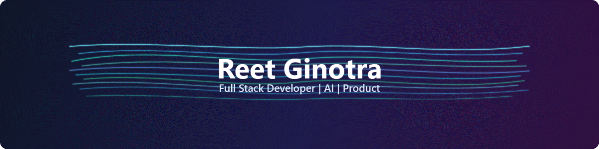

<!-- HERO -->
<!-- EDIT: Update the banner path, display name, or one-line tagline here. Do not change assets/banner.gif unless you intentionally replace the approved banner asset. -->

  
    
  <h1>Myself Reet Ginotra &#128075;</h1>
  
<b>AI/ML &times; Full-Stack Developer</b>

---

<!-- ABOUT -->
<!-- EDIT: Keep this section short and natural. Use 2-3 lines about what you build, explore, and enjoy working on. -->
## About Me

I enjoy building AI/ML systems, full-stack applications, and small experiments that turn interesting ideas into something real.
Most of my work lives somewhere between intelligent products, backend logic, polished interfaces, and trying out new tools just to see what they can do.

---

<!-- HIGHLIGHTS -->
<!-- EDIT: Keep this section casual and human. Swap these short facts/interests in and out as your current vibe changes. -->
## A Little About Me

|  |  |
| --- | --- |
| :coffee: Usually building or tinkering with something | :brain: Curious about intelligent systems and how people use them |
| :hammer_and_wrench: I like taking ideas from model to product | :computer: I genuinely enjoy problem solving and shipping side experiments |
| :art: Always exploring new tools, workflows, and interfaces | :seedling: Still learning, still iterating, still making things better |

---

<!-- ACADEMIC SIDEQUESTS -->
<!-- EDIT: Keep academics and research tucked into these collapsible blocks. This is the only section meant for CGPA, publications, grants, patents, or academic distinctions. -->
## Academic Sidequests

  
<b>Academic & Awards</b>

   

- Current CGPA: **8.91**
- Awarded **Full Fee Waiver for Classes 11 and 12** for exemplary academic performance.

  
<b>Research & Publications</b>

   

- **Acoustic Feature-Based Speech Depression Recognition Using Bidirectional LSTM and Transformer Architectures**  
  Accepted Q1 level paper, applied for journal and is in progress
- **Machine Learning-Based Depression Detection from Text Using Hybrid Feature Engineering and Ensemble Models**  
  Accepted for presentation at **ICTIS 2026** and presented at the conference in **Bangkok**.
- Awarded an **INR 2.7 lakh Manipal Research Board (MRB) Seed Grant** for research on AI-driven multimodal mental health risk assessment.
- **Patent filing in progress**

---

<!-- TECH STACK -->
<!-- EDIT: Add or remove badges only within the categories below. Keep the categories stable so this section stays easy to maintain. -->
## Tech Stack

**Languages**

**Frontend**

**Backend**

**AI / ML**

**Tools & Workflow**

---

<!-- GITHUB ACTIVITY -->
<!-- EDIT: Replace the username in the image URLs if your GitHub username changes. Keep the picture tags for light/dark mode support. -->
## GitHub Activity

  <picture>
    <source media="(prefers-color-scheme: dark)" srcset="https://github-readme-stats.vercel.app/api?username=reettginotra&show_icons=true&theme=catppuccin_mocha&hide_border=false" />
    <source media="(prefers-color-scheme: light)" srcset="https://github-readme-stats.vercel.app/api?username=reettginotra&show_icons=true&theme=catppuccin_latte&hide_border=false" />
    
  </picture>
  &nbsp;
  <picture>
    <source media="(prefers-color-scheme: dark)" srcset="https://github-readme-stats.vercel.app/api/top-langs/?username=reettginotra&layout=compact&theme=catppuccin_mocha&hide_border=false" />
    <source media="(prefers-color-scheme: light)" srcset="https://github-readme-stats.vercel.app/api/top-langs/?username=reettginotra&layout=compact&theme=catppuccin_latte&hide_border=false" />
    
  </picture>

  <picture>
    <source media="(prefers-color-scheme: dark)" srcset="https://streak-stats.demolab.com/?user=reettginotra&theme=catppuccin-mocha&hide_border=false" />
    <source media="(prefers-color-scheme: light)" srcset="https://streak-stats.demolab.com/?user=reettginotra&theme=catppuccin-latte&hide_border=false" />
    
  </picture>

---

<!-- CONNECT -->
<!-- EDIT: Replace links below with your final public URLs. Keep this section simple, readable, and easy to update. -->
## Connect With Me

  

